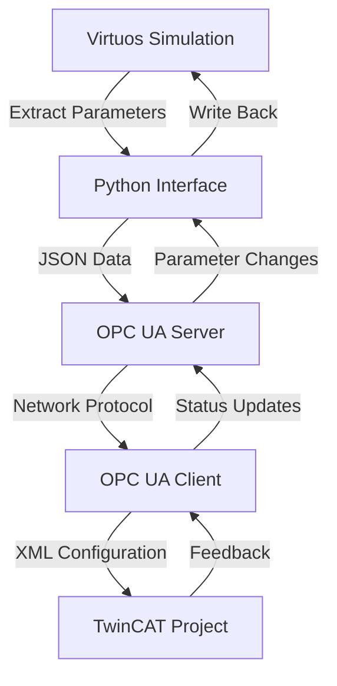

# Industrial Automation Pipeline - Virtuos & TwinCAT Bridge

[English](#english) | [Deutsch](#deutsch)

## English

### Overview
This project is a comprehensive industrial automation pipeline that creates a bridge between **Virtuos** (ISG simulation platform) and **TwinCAT** (Beckhoff automation platform) using **OPC UA** as the communication protocol. The system provides real-time parameter synchronization, automated configuration management, and a user-friendly web interface built with NiceGUI.

### 🚀 Key Features

#### Multi-Platform Integration
- **Virtuos Integration**: Connect to ISG Virtuos simulation environment
- **TwinCAT Integration**: Interface with Beckhoff TwinCAT automation system
- **OPC UA Bridge**: Real-time bidirectional data exchange
- **Robot Control**: Specialized robot parameter management

#### User Interface
- **Web-based GUI**: Modern, responsive interface using NiceGUI
- **Multi-tab Interface**: Separate workspaces for different operations
- **Real-time Logging**: Live operation status and error reporting
- **One-click Operations**: Automated workflows for common tasks

#### Data Management
- **JSON Configuration**: Flexible parameter storage and mapping
- **XML Import/Export**: TwinCAT project file manipulation  
- **Real-time Sync**: Automatic parameter synchronization
- **Change Tracking**: Monitor and approve parameter modifications

### 📋 System Requirements

- **Python**: 3.8 or higher
- **Windows OS**: Required for TwinCAT integration
- **ISG Virtuos**: Version 3.7 or compatible
- **TwinCAT**: XAE (eXtended Automation Engineering)
- **Network Access**: For OPC UA communication

### 🛠️ Installation

1. **Clone the repository**
   ```bash
   git clone <repository-url>
   cd Pipeline_Code
   ```

2. **Install Python dependencies**
   ```bash
   pip install -r requirements.txt
   ```

3. **Configure environment variables**
   - Copy `.env.example` to `lib/config/.env`
   - Update paths and network settings:
   ```properties
   # TwinCAT Configuration
   TWINCAT_PROJECT_PATH=D:\Path\To\Your\TwinCAT\Project.sln
   AMS_NET_ID=192.168.3.72.1.1
   
   # Virtuos Configuration  
   envLibDll=C:/ISG/ISG-virtuos_3_7/bin_x64/virtuos_interface_x64.dll
   project_path=D:\Path\To\Your\Virtuos\Project.epf
   
   # OPC UA Server
   SERVER_IP=192.168.3.22
   SERVER_PORT=4840
   ```

4. **Setup certificates** (Optional - for secure OPC UA)
   - Place SSL certificates in `lib/config/opcua_certs/`

### 🚦 Quick Start

1. **Launch the application**
   ```bash
   python main.py
   ```

2. **Open web interface**
   - The NiceGUI interface will open automatically
   - Navigate between tabs for different operations

3. **Basic workflow**
   - **Virtuos Tab**: Connect to Virtuos → Start OPC UA Server → Configure mappings
   - **TwinCAT Tab**: Initialize project → Connect to OPC UA → Sync parameters

### 📖 User Guide

#### Tab Overview

##### 🔧 Virtuos Server Page
- **Purpose**: Bridge Virtuos simulation data to OPC UA
- **Key Functions**:
  - Connect to existing Virtuos instance
  - Configure Block → Kanal mappings  
  - Start/stop OPC UA server
  - Real-time parameter refresh
  - Change confirmation system

##### 🏭 TwinCAT Manual Page  
- **Purpose**: Manual TwinCAT parameter management
- **Key Functions**:
  - Initialize TwinCAT project
  - Import/export XML configurations
  - Manual parameter read/write
  - Axis and transformation parameter handling

##### 🤖 TwinCAT Auto Page
- **Purpose**: Automated TwinCAT operations  
- **Key Functions**:
  - One-click full synchronization
  - Automated parameter reading/writing
  - OPC UA change listener
  - Batch operations

##### 📋 TwinCAT Create Auto Page
- **Purpose**: Dynamic CNC structure creation
- **Key Functions**:
  - Generate Kanal/Axis structures
  - Automated XML generation
  - Structure validation

##### 🔗 TwinCAT Adapter Page
- **Purpose**: Hardware adapter configuration
- **Key Functions**:
  - Adapter parameter management
  - Hardware mapping configuration

##### 🤖 Virtuos Robot Page
- **Purpose**: Robot-specific parameter control
- **Key Functions**:
  - Robot configuration management
  - Specialized robot parameter handling

#### Common Workflows

##### Workflow 1: Virtuos to TwinCAT Sync
1. **Virtuos Server Tab**:
   - Connect to Virtuos
   - Configure Block mappings
   - Start OPC UA Server
2. **TwinCAT Auto Tab**:  
   - Connect to OPC UA
   - Initialize TwinCAT project
   - Execute "One-click CNC Init + Write"

##### Workflow 2: TwinCAT to Virtuos Sync
1. **TwinCAT Manual Tab**:
   - Initialize TwinCAT project  
   - Connect to OPC UA client
   - Execute "One-click Read"
2. **Virtuos Server Tab**:
   - Confirm parameter changes
   - Write back to Virtuos

### 🏗️ Architecture

```
┌─────────────────┐    ┌─────────────────┐    ┌─────────────────┐
│     Virtuos     │    │    OPC UA       │    │    TwinCAT      │
│   (Simulation)  │◄──►│    Server       │◄──►│  (Automation)   │
└─────────────────┘    └─────────────────┘    └─────────────────┘
        │                       │                       │
        ▼                       ▼                       ▼
┌─────────────────┐    ┌─────────────────┐    ┌─────────────────┐
│  Block Diagram  │    │  JSON Configs   │    │   XML Files     │
│   Parameters    │    │  & Mappings     │    │ & CNC Configs   │
└─────────────────┘    └─────────────────┘    └─────────────────┘
```

#### Key Components

- **`lib/services/`**: Core business logic
  - `Virtuos_tool.py`: Virtuos interface wrapper
  - `TwinCAT_interface.py`: TwinCAT automation interface  
  - `server.py`: OPC UA server implementation
  - `client.py`: OPC UA client utilities
  - `twincat_manager.py`: TwinCAT operations manager

- **`lib/screens/`**: User interface modules
  - `nicegui_virtuos_opcua.py`: Virtuos bridge interface
  - `nicegui_twincat_*.py`: TwinCAT interface variations  

- **`lib/utils/`**: Utility functions
  - `xml_read_write.py`: XML manipulation
  - `save_to_file.py`: Data persistence
  - `helper.py`: Common utilities

- **`lib/config/`**: Configuration files
  - `.env`: Environment variables
  - `*.json`: Parameter mappings and data structures

### 🔧 Configuration

#### Environment Variables
The system uses environment variables for flexible configuration:

```properties
# Essential TwinCAT Settings
TWINCAT_PROJECT_PATH=    # Path to TwinCAT solution file
AMS_NET_ID=             # TwinCAT AMS Net ID

# Virtuos Settings  
envLibDll=              # Path to Virtuos interface DLL
project_path=           # Path to Virtuos project file

# OPC UA Settings
SERVER_IP=              # OPC UA server IP address
SERVER_PORT=            # OPC UA server port (default: 4840)
client_username=        # OPC UA client username
client_password=        # OPC UA client password
```

#### Mapping Files
- **`Kanal_Axis_mapping.json`**: Axis parameter mapping rules
- **`Robot_Daten.json`**: Robot-specific configurations  

### 🐛 Troubleshooting

#### Common Issues

**Connection Problems**
- ✅ Check network connectivity between systems
- ✅ Verify OPC UA server/client credentials  
- ✅ Ensure TwinCAT runtime is active
- ✅ Confirm Virtuos project is loaded

**Parameter Sync Issues**  
- ✅ Validate parameter mappings in JSON files
- ✅ Check XML structure compatibility
- ✅ Verify data type conversions

**Performance Issues**
- ✅ Adjust OPC UA subscription intervals
- ✅ Optimize parameter batch sizes
- ✅ Monitor system resource usage

#### Logging
The application provides comprehensive logging:
- **Web Interface**: Real-time log display in each tab
- **Console Output**: Detailed technical information  
- **File Logging**: Persistent error and operation logs

### 📊 Data Flow



### 🔄 Synchronization Process

1. **Data Extraction**: Parameters extracted from Virtuos block diagrams
2. **Format Conversion**: Convert to standardized JSON format
3. **OPC UA Publishing**: Expose data via OPC UA server nodes
4. **Client Consumption**: TwinCAT clients subscribe to parameter changes
5. **XML Generation**: Convert OPC UA data to TwinCAT XML format
6. **Configuration Apply**: Import XML to active TwinCAT project
7. **Bidirectional Sync**: Changes flow back through the pipeline

### 🚨 Safety & Security

- **Authentication**: OPC UA user/password authentication
- **SSL/TLS**: Optional encrypted communication
- **Change Confirmation**: User approval for critical parameter changes
- **Rollback Support**: Ability to revert configuration changes
- **Audit Logging**: Complete operation history tracking

### ⚡ Performance Optimization

- **Batch Operations**: Group parameter updates for efficiency
- **Async Processing**: Non-blocking UI operations
- **Connection Pooling**: Reuse network connections
- **Caching**: Local parameter caching to reduce network calls
- **Selective Sync**: Update only changed parameters

### 🤝 Contributing

1. Fork the repository
2. Create a feature branch (`git checkout -b feature/amazing-feature`)
3. Commit changes (`git commit -m 'Add amazing feature'`)
4. Push to branch (`git push origin feature/amazing-feature`)  
5. Open a Pull Request

### 📄 License

This project is part of a Master's thesis research work.

### 🆘 Support

For technical support or questions:
- Create an issue in the repository
- Check the troubleshooting section above
- Review log outputs for error details

---

## Deutsch

### Überblick
Dieses Projekt ist eine umfassende industrielle Automatisierungspipeline, die eine Brücke zwischen **Virtuos** (ISG-Simulationsplattform) und **TwinCAT** (Beckhoff-Automatisierungsplattform) mittels **OPC UA** als Kommunikationsprotokoll schafft. Das System bietet Echtzeit-Parametersynchronisation, automatisierte Konfigurationsverwaltung und eine benutzerfreundliche Weboberfläche basierend auf NiceGUI.

### 🚀 Hauptfunktionen

#### Multi-Plattform-Integration
- **Virtuos-Integration**: Verbindung zur ISG Virtuos Simulationsumgebung
- **TwinCAT-Integration**: Schnittstelle zum Beckhoff TwinCAT Automatisierungssystem
- **OPC UA Bridge**: Bidirektionaler Echtzeitdatenaustausch
- **Robotersteuerung**: Spezialisierte Roboterparameterverwaltung

#### Benutzeroberfläche
- **Webbasierte GUI**: Moderne, responsive Oberfläche mit NiceGUI
- **Multi-Tab-Interface**: Separate Arbeitsbereiche für verschiedene Operationen
- **Echtzeit-Logging**: Live-Betriebsstatus und Fehlerberichterstattung
- **Ein-Klick-Operationen**: Automatisierte Arbeitsabläufe für häufige Aufgaben

#### Datenmanagement
- **JSON-Konfiguration**: Flexible Parameterspeicherung und -zuordnung
- **XML-Import/Export**: TwinCAT-Projektdatei-Manipulation
- **Echtzeit-Sync**: Automatische Parametersynchronisation
- **Änderungsverfolgung**: Überwachung und Genehmigung von Parameteränderungen

### 📋 Systemanforderungen

- **Python**: 3.8 oder höher
- **Windows OS**: Erforderlich für TwinCAT-Integration
- **ISG Virtuos**: Version 3.7 oder kompatibel
- **TwinCAT**: XAE (eXtended Automation Engineering)
- **Netzwerkzugang**: Für OPC UA Kommunikation

### 🛠️ Installation

1. **Repository klonen**
   ```bash
   git clone <repository-url>
   cd Pipeline_Code
   ```

2. **Python-Abhängigkeiten installieren**
   ```bash
   pip install -r requirements.txt
   ```

3. **Umgebungsvariablen konfigurieren**
   - `.env` Datei in `lib/config/` erstellen und Pfade anpassen:
   ```properties
   # TwinCAT Konfiguration
   TWINCAT_PROJECT_PATH=D:\Pfad\Zu\Ihrem\TwinCAT\Projekt.sln
   AMS_NET_ID=192.168.3.72.1.1
   
   # Virtuos Konfiguration
   envLibDll=C:/ISG/ISG-virtuos_3_7/bin_x64/virtuos_interface_x64.dll
   project_path=D:\Pfad\Zu\Ihrem\Virtuos\Projekt.epf
   
   # OPC UA Server
   SERVER_IP=192.168.3.22
   SERVER_PORT=4840
   ```

### 🚦 Schnellstart

1. **Anwendung starten**
   ```bash  
   python main.py
   ```

2. **Web-Interface öffnen**
   - Die NiceGUI-Oberfläche öffnet sich automatisch
   - Navigieren Sie zwischen den Tabs für verschiedene Operationen

3. **Grundlegender Arbeitsablauf**
   - **Virtuos Tab**: Mit Virtuos verbinden → OPC UA Server starten → Mappings konfigurieren
   - **TwinCAT Tab**: Projekt initialisieren → Mit OPC UA verbinden → Parameter synchronisieren

### 🏗️ Architektur

Das System verwendet eine modulare Architektur mit klarer Trennung von Geschäftslogik und Benutzeroberfläche:

- **Virtuos-Schnittstelle**: Direkte Verbindung zur Simulationsumgebung
- **OPC UA-Layer**: Standardisierte Kommunikationsschicht
- **TwinCAT-Integration**: Automatisierte Konfigurationsverwaltung
- **Web-UI**: Benutzerfreundliche Bedienoberfläche

### 📖 Benutzerhandbuch

#### Tab-Übersicht

##### 🔧 Virtuos Server Seite
- **Zweck**: Brücke zwischen Virtuos-Simulationsdaten und OPC UA
- **Hauptfunktionen**:
  - Verbindung zu bestehender Virtuos-Instanz
  - Konfiguration von Block → Kanal Mappings
  - Start/Stop des OPC UA Servers
  - Echtzeit-Parameteraktualisierung

##### 🏭 TwinCAT Manual Seite
- **Zweck**: Manuelle TwinCAT-Parameterverwaltung
- **Hauptfunktionen**:
  - TwinCAT-Projekt initialisieren
  - XML-Konfigurationen importieren/exportieren
  - Manuelle Parameter lesen/schreiben

##### 🤖 TwinCAT Auto Seite
- **Zweck**: Automatisierte TwinCAT-Operationen
- **Hauptfunktionen**:
  - Ein-Klick-Vollsynchronisation
  - Automatisierte Parameter-Lese-/Schreibvorgänge
  - OPC UA Änderungs-Listener

### 🔧 Konfiguration

#### Umgebungsvariablen
Das System nutzt Umgebungsvariablen für flexible Konfiguration. Die wichtigsten Einstellungen:

```properties
# TwinCAT-Einstellungen
TWINCAT_PROJECT_PATH=    # Pfad zur TwinCAT-Lösungsdatei
AMS_NET_ID=             # TwinCAT AMS Net ID

# Virtuos-Einstellungen
envLibDll=              # Pfad zur Virtuos-Interface-DLL
project_path=           # Pfad zur Virtuos-Projektdatei

# OPC UA-Einstellungen
SERVER_IP=              # OPC UA Server IP-Adresse
SERVER_PORT=            # OPC UA Server Port (Standard: 4840)
```

#### Mapping-Dateien
- **`Kanal_Axis_mapping.json`**: Achsen-Parameter-Mapping-Regeln
- **`Robot_Daten.json`**: Roboter-spezifische Konfigurationen

### 🐛 Fehlerbehebung

#### Häufige Probleme

**Verbindungsprobleme**
- ✅ Netzwerkverbindung zwischen Systemen prüfen
- ✅ OPC UA Server/Client-Anmeldedaten verifizieren
- ✅ TwinCAT-Runtime ist aktiv
- ✅ Virtuos-Projekt ist geladen

**Parameter-Synchronisierungsprobleme**
- ✅ Parameter-Mappings in JSON-Dateien validieren
- ✅ XML-Strukturkompatibilität prüfen
- ✅ Datentypkonvertierungen verifizieren

#### Protokollierung
Die Anwendung bietet umfassende Protokollierung:
- **Web-Interface**: Echtzeit-Log-Anzeige in jedem Tab
- **Konsolen-Ausgabe**: Detaillierte technische Informationen
- **Datei-Protokollierung**: Persistente Fehler- und Betriebsprotokolle

---

*Dieses Projekt ist Teil einer Masterarbeits-Forschungsarbeit zur industriellen Automatisierung und Systemintegration.*
